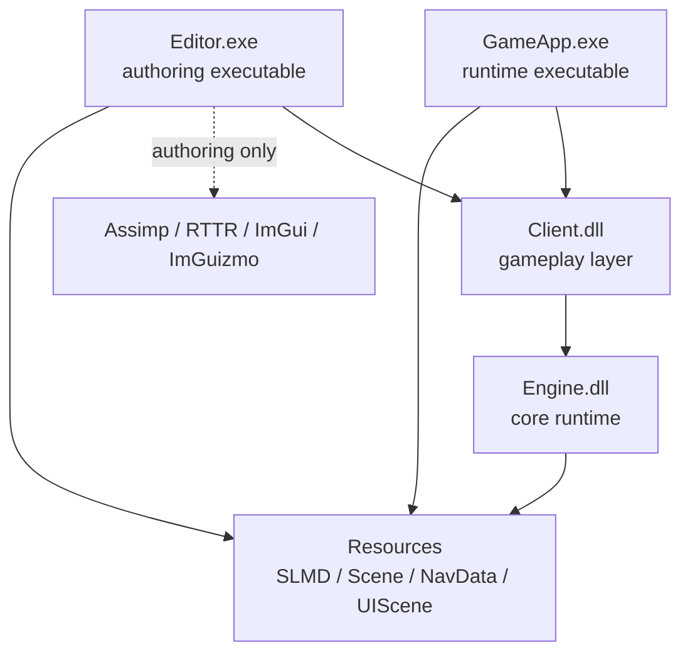

<div align="center">

# Solo Leveling

### DirectX 11 Action RPG Framework + Custom Editor

수업용 DirectX 11 프레임워크를 기반으로, **런타임 엔진 / 게임플레이 DLL / 실행 앱 / 자체 에디터**를 분리하고
모델 파이프라인, Scene/NavMesh/UI 저작, 액션 전투 시스템까지 확장한 C++ 포트폴리오 프로젝트입니다.

`C++17` · `DirectX 11` · `HLSL` · `Effects11` · `DirectXTK` · `Assimp` · `RTTR` · `ImGui` · `ImGuizmo`

**2026.03.31 ~ 2026.05.20, 진행 중** · **4개 모듈** `Engine / Client / GameApp / Editor` · **83 commits**

</div>

---

## 핵심 요약

> **게임 하나를 만드는 데서 멈추지 않고, 게임을 만들기 위한 프레임워크와 제작 파이프라인을 직접 확장한 프로젝트입니다.**

이 프로젝트의 중심은 개별 기능의 개수보다 **구조화**입니다.
런타임은 가볍고 안정적으로 유지하고, 외부 라이브러리와 저작 기능은 Editor에 격리했습니다. Client는 GameApp과 Editor가 함께 호스팅하는 게임플레이 DLL로 두어, 실제 게임 실행과 에디터 검증이 같은 런타임 객체를 바라보도록 설계했습니다.

중점적으로 다룬 영역은 다음입니다.

| 초점 | 설명 |
|---|---|
| **4-Module Framework** | `Engine.dll -> Client.dll -> GameApp.exe / Editor.exe` 구조로 런타임과 저작 환경을 분리 |
| **Editor-Only Toolchain** | Assimp, RTTR, ImGui, ImGuizmo를 Editor에 격리하고 Engine은 자체 데이터만 로드 |
| **Gameplay Architecture** | 입력, 상태머신, 애니메이션, AnimNotify, 충돌, HUD를 하나의 전투 흐름으로 연결 |
| **Data-Driven Runtime** | SLMD, Scene, NavData, UIScene을 versioned binary format으로 관리 |
| **Decision Log 기반 개발** | `명세서/`에 대안, 선택 이유, 보류 사유, 구조적 함정을 기록하며 진행 |

---

## Framework Architecture



| Module | 책임 |
|---|---|
| **Engine** | DirectX 11 device/context, renderer, component, model/animation loader, collision, navigation, resource lifetime |
| **Client** | Player, Monster, Camera, HUD, UI, Level, game state machine, gameplay serialization |
| **GameApp** | 순수 런타임 entry point. Editor 의존성 없이 Client와 Engine만 사용 |
| **Editor** | ImGui 기반 저작 도구. FBX 변환, Transform 조작, NavMesh/UI/Scene 편집 담당 |

핵심 방향은 **의존성의 방향을 단순하게 유지하는 것**입니다.

```text
Editor-only libraries
        |
        v
Editor.exe        GameApp.exe
    \              /
     v            v
        Client.dll
            |
            v
        Engine.dll
```

Engine은 Assimp, RTTR, ImGui, ImGuizmo를 모릅니다. Editor가 외부 도구를 사용해 데이터를 만들고, 런타임은 검증된 자체 포맷만 읽습니다.

---

## Runtime Flow

```text
Input_Device::Update
  -> Priority_Update      # camera, high priority objects
  -> Update               # gameplay logic
  -> PipeLine::Update     # view/proj cache
  -> Late_Update          # render group registration, animation late work
  -> Collision_Manager    # pair check, enter/stay/exit
  -> Renderer::Draw       # priority -> nonblend -> blend -> ui
  -> DebugDraw / ImGui(Editor) / Present
```

이 흐름 위에 Player, Monster, HUD, Collision, UI를 얹었습니다. 각 시스템이 직접 서로를 강하게 물고 늘어지는 구조를 피하고, 가능한 한 `GameInstance`, component, notify, state machine을 통해 결합도를 낮췄습니다.

---

## Data Pipeline

```text
FBX
  -> Editor CModel_Converter
  -> SLMD .bin
  -> Engine CModel loader
  -> Prototype registration
  -> Clone into GameApp / Editor scene
```

| Data | 역할 |
|---|---|
| **SLMD** | 자체 모델/애니메이션 바이너리. mesh, material, bone, animation, notify 저장 |
| **NavData** | NavMesh vertex/cell 데이터. neighbor는 로드 후 재계산 |
| **SceneData** | NavData 경로와 SpawnPoint를 포함한 런타임 scene 정보 |
| **UIScene** | UI element 배치, 텍스처, 색상, sweep mode 등 HUD/UI 데이터 |

SLMD는 v1에서 시작해 loop/root motion/pre-transform, 이후 AnimNotify까지 확장했습니다. 포맷이 변할 때마다 기존 데이터를 버리지 않기 위해 version 분기와 fallback 로드를 유지했습니다.

---

## Design Patterns

이 프로젝트에서 패턴은 이름을 붙이기 위해 넣은 것이 아니라, 프레임워크의 책임 경계를 유지하기 위해 사용했습니다.

| Pattern | 적용 | 의도 |
|---|---|---|
| **Layered Architecture** | Engine / Client / GameApp / Editor | 런타임 코어, 게임 로직, 실행 앱, 저작 도구의 책임 분리 |
| **Facade / Service Locator** | `CGameInstance` | Renderer, Object, Component, Collision, Font 등 하위 매니저 접근 창구 통일 |
| **Prototype + Clone** | `Add_Prototype -> Clone_Prototype` | Editor와 GameApp에서 같은 런타임 객체를 안전하게 생성 |
| **Component Pattern** | Transform, Shader, Model, Collider, NavigationAgent | GameObject 기능을 조합 가능하게 분리 |
| **Composite** | `CContainerObject` / `CPartObject` | Player, Monster, Weapon처럼 여러 파츠가 하나의 캐릭터처럼 동작 |
| **State Machine** | Player / Monster action transition | 입력과 애니메이션 전이를 priority, auto-return, lock 규칙으로 제어 |
| **Observer/Event** | `INotifyListener`, AnimNotify | 애니메이션 키프레임 이벤트를 충돌, 콤보, HUD로 전달 |
| **Policy Table** | animation/action policy table | 하드코딩된 animation index 대신 의미 기반 action mapping |
| **Serializer + Versioning** | SLMD, NavData, SceneData, UIScene | 데이터 포맷 변화에 대응 가능한 저장/로드 구조 |
| **Manual Lifetime Policy** | `CBase`, `Safe_AddRef`, `Safe_Release` | DLL 경계와 D3D 리소스 수명 관리를 명시적으로 통제 |

가장 중요하게 본 지점은 **상태와 데이터의 주인을 하나로 고정하는 것**입니다. Transform, animation index, UI pass, NavMesh owner, target reference가 여러 곳에 흩어지면 Editor와 Runtime이 동시에 깨지기 때문에, Single Source of Truth를 정하고 나머지는 조회하거나 캐시하는 방식으로 정리했습니다.

---

## Core Systems

### Editor Toolchain

- ImGui docking 기반 Editor shell
- Hierarchy / Inspector / Viewport / Content Browser / Log / Shortcuts / 2D Canvas / NavMesh 패널
- RTTR 기반 Transform property 편집
- ImGuizmo 기반 Viewport Transform 조작
- FBX 우클릭 변환으로 SLMD `.bin` 생성
- NavMesh, SpawnPoint, UI Canvas 저작 후 런타임 데이터로 저장

### Gameplay Framework

- `Input_Device -> IntentResolver -> Player_StateMachine`
- `State x Action x Weapon` 기반 animation lookup
- Basic Attack combo, Guard, Dash charge, root motion
- Monster Break / Crash / Death transition
- 거리 기반 Boss AI 1차 패턴 선택

### Collision / Animation Event

- Collider는 component로 분리하고, 매 프레임 Collision Manager에 등록
- Collision Group Matrix로 검사 대상을 제한
- AnimNotify가 공격 판정 타이밍을 열고 닫음
- Weapon OBB는 socket bone world matrix를 기준으로 갱신

### UI / HUD

- UI element를 Editor에서 배치하고 `.uiscene`으로 저장
- HUD는 게임 오브젝트로 런타임 layer에 통합
- HP/MP/Break/Dash는 shader 기반 UV clip과 sweep pass로 표현

---

## 구조적 고민

### 1. Runtime에 Assimp를 넣을 것인가, Editor에 격리할 것인가

수업 구조는 Engine에서 모델 로딩을 직접 처리하는 방향에 가까웠지만, 이 프로젝트에서는 Assimp를 Editor에만 두었습니다. 런타임 배포 대상이 외부 import library와 FBX parsing 정책을 알 필요가 없도록 만들기 위해서입니다.

결과적으로 Engine은 SLMD 바이너리만 읽고, Editor는 복잡한 변환과 검증을 담당합니다. 이 결정이 이후 NavData, SceneData, UIScene까지 이어져서 **Editor는 저작, Runtime은 소비**라는 구조가 명확해졌습니다.

### 2. 애니메이션을 index로 고를 것인가, 의미로 고를 것인가

초기에는 animation index를 직접 다루는 방식이 단순했습니다. 하지만 공격, 이동, 가드, 무기 상태가 늘어나면서 같은 입력도 상태와 무기에 따라 다른 의미를 갖게 되었습니다.

그래서 `State x Action x Weapon -> AnimationName -> cached index` 구조로 방향을 바꿨습니다. 이 구조 덕분에 gameplay code는 "몇 번 애니메이션 재생"이 아니라 "현재 상태에서 어떤 action을 시도"하는 방식으로 유지됩니다.

### 3. 캐릭터를 단일 오브젝트로 둘 것인가, 파츠 조합으로 둘 것인가

Player와 Monster는 단순 mesh 하나가 아니라 Body, Weapon, socket, hitbox가 결합된 객체입니다. 이를 하나의 거대한 클래스에 넣으면 렌더링, 충돌, 장착, 애니메이션 책임이 섞입니다.

그래서 `CContainerObject`와 `CPartObject` 구조로 나누고, parent matrix와 socket bone matrix를 통해 파츠를 합성했습니다. 이 구조는 Weapon visibility, hitbox, monster weapon attach 같은 확장에 직접 사용됩니다.

### 4. 충돌을 오브젝트끼리 직접 검사할 것인가, Manager에 모을 것인가

공격 판정은 Player와 Monster가 서로 직접 검사하게 만들 수도 있습니다. 하지만 그렇게 하면 전투 대상이 늘어날수록 의존성이 빠르게 엉킵니다.

현재 구조는 Collider가 매 프레임 자신을 등록하고, Collision Manager가 group matrix 기준으로 pair를 검사한 뒤 Enter/Stay/Exit callback을 보냅니다. 오브젝트는 "내 collider가 무엇을 맞았는가"만 처리하고, 전체 pair 구성은 Manager가 담당합니다.

### 5. CrossFade를 당장 완성할 것인가, 상태 구조를 먼저 안정화할 것인가

애니메이션 블렌딩은 1차 구현까지 시도했지만, root motion, notify, action priority, auto-return이 동시에 얽히면서 단순 보간으로 해결할 문제가 아니라고 판단했습니다.

그래서 CrossFade를 억지로 밀기보다, 먼저 state/action/weapon 기반 선택 구조와 notify 기반 event flow를 안정화했습니다. 이 결정은 "기능을 끝까지 우겨 넣는 것"보다 **프레임워크가 감당 가능한 순서를 선택하는 것**을 배운 지점입니다.

---

## AI 활용 방식

AI는 코드를 대신 맡기는 도구가 아니라, **설계 선택지를 정리하고 검증 순서를 세우는 페어 프로그래밍 도구**로 사용했습니다.

| 활용 | 방식 |
|---|---|
| **설계 대안 비교** | 구조 변경 전 여러 후보의 장단점과 파급 범위 정리 |
| **작업 단위 분해** | 큰 기능을 Track / Step / commit 단위로 쪼갬 |
| **리스크 리뷰** | 수명 관리, DLL 경계, Editor 의존성, 상태 전이 충돌 가능성 점검 |
| **문서화** | 결정 이유, 보류 사유, 후속 작업을 `명세서/`에 정리 |

최종 선택, 빌드/실행 검증, 시각적 판단, 자산 변환 결과 확인은 직접 수행했습니다.
AI 활용의 핵심은 결과물을 그대로 받아들이는 것이 아니라, **검증 가능한 결정과 작업 단위로 바꾸는 것**이었습니다.

---

## Development Flow

기능은 브랜치와 커밋 단위로 분리했습니다.

```text
feature/ImGuizmo      Editor transform 조작 + Inspector 연동
feature/Player        Input/Intent/StateMachine + combo/guard
feature/Camera        Follow camera + Style C movement
feature/NavMesh       NavMesh editor + SceneData spawn
feature/Font-2DUI     Font system + 2D Canvas + Logo/Loading
feature/Collision     Collider + group matrix + AnimNotify hitbox
feature/HUD           Gameplay HUD + Boss AI 1차
```

`명세서/통합_구현계획_v3.md`는 현재 작업의 기준 문서입니다. 완료, 보류, 변경된 결정은 삭제하지 않고 이유를 남겼습니다.

---

## Repository Structure

```text
Solo_Leveling/
├── Engine/          # core DLL: D3D, component, renderer, model, collision, navmesh
├── Client/          # gameplay DLL: player, monster, state machine, UI, HUD, scene loader
├── GameApp/         # runtime executable
├── Editor/          # authoring executable: ImGui, ImGuizmo, RTTR, Assimp
├── Resources/       # shader, model, texture, font, scene, navmesh, ui data
├── EngineSDK/       # post-build copied engine headers/libs/binaries
├── ClientSDK/       # post-build copied client headers/libs/binaries
└── 명세서/           # planning, decision log, daily notes, structural notes
```

---

## Build

필수 환경:

- Windows 10/11
- Visual Studio 2022
- Desktop development with C++
- Windows 10 SDK
- x64

```powershell
msbuild Solo_Leveling.sln /p:Configuration=Debug /p:Platform=x64
```

Release 빌드:

```powershell
msbuild Solo_Leveling.sln /p:Configuration=Release /p:Platform=x64
```

실행 파일:

| Target | Path |
|---|---|
| Runtime | `GameApp/Bin/GameApp.exe` |
| Editor | `Editor/Bin/Editor.exe` |

---

## Documentation

- [`명세서/통합_구현계획_v3.md`](명세서/통합_구현계획_v3.md): 현재 구현 계획과 Decision Log
- [`명세서/Editor_전체_구현계획.md`](명세서/Editor_전체_구현계획.md): Editor 설계와 구현 흐름
- [`명세서/단계3_Player_세부계획.md`](명세서/단계3_Player_세부계획.md): Player 입력/상태/애니메이션 설계
- [`CLAUDE.md`](CLAUDE.md): AI 협업 규칙과 프로젝트 컨벤션

---

## Asset Notice

캐릭터, 무기, 맵 등 일부 리소스는 *Solo Leveling: OverDrive* 자산을 학습/포트폴리오 목적으로 추출해 사용했습니다. 본 저장소는 상업적 사용이나 배포 목적이 아닙니다.

외부 라이브러리:

| Library | Usage |
|---|---|
| DirectXTK | font, primitive/debug rendering, bounding helper |
| Assimp | Editor-only FBX import |
| RTTR | Editor Inspector reflection |
| ImGui | Editor UI |
| ImGuizmo | Viewport transform manipulation |

---

<div align="center">

**이 프로젝트의 핵심은 기능 나열이 아니라, 수업 프레임워크를 실제 제작 루프가 가능한 구조로 확장한 과정입니다.**

</div>
