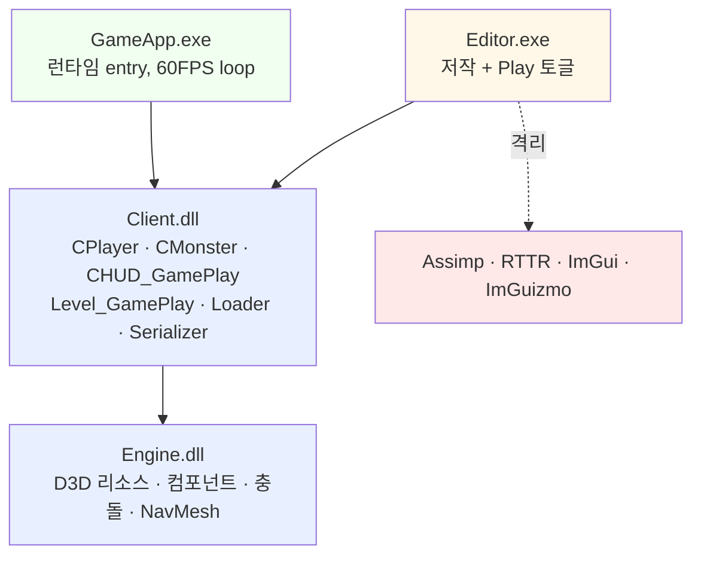
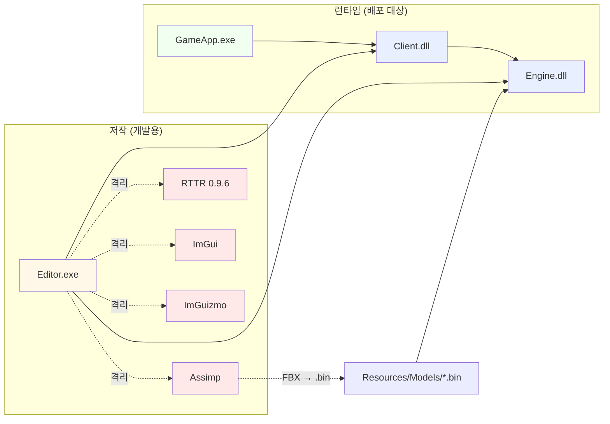
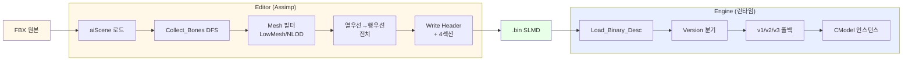
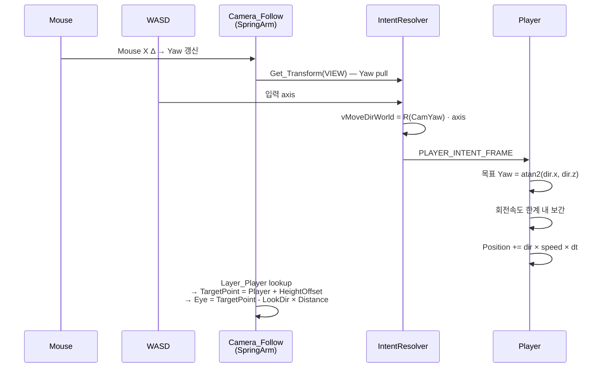
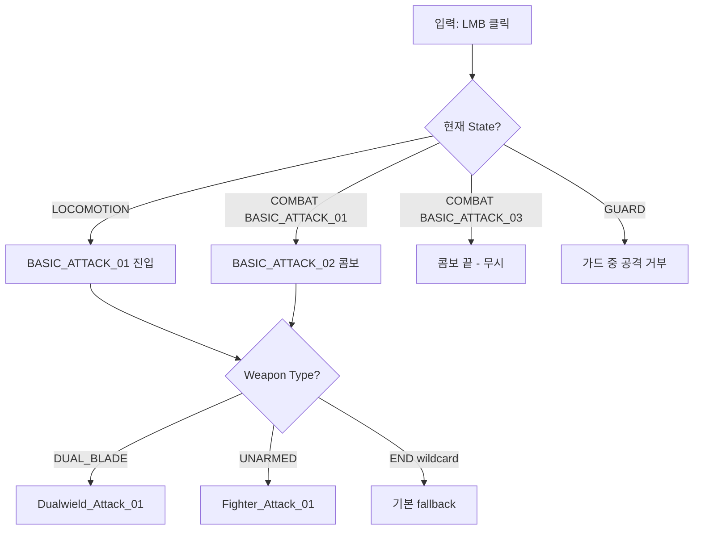
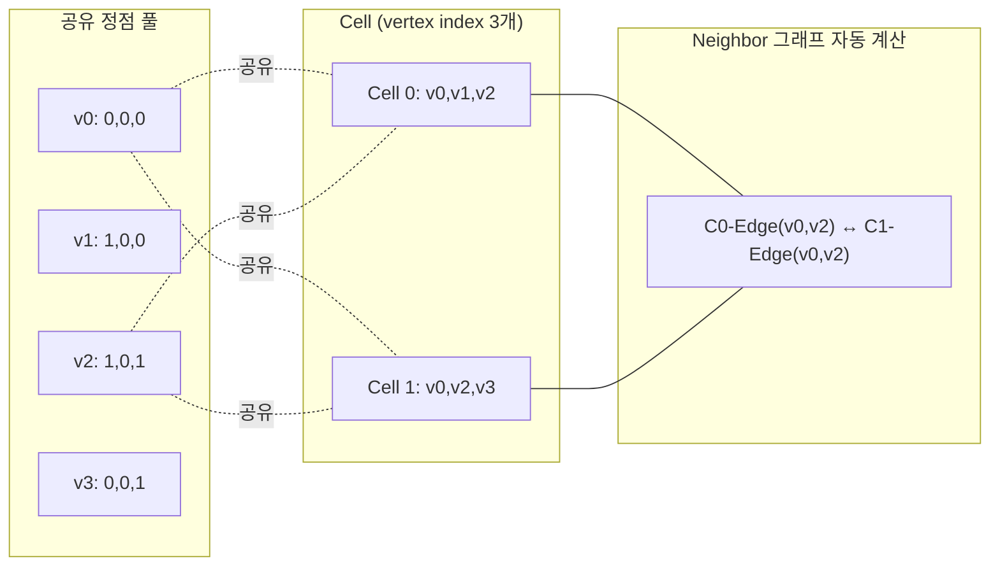
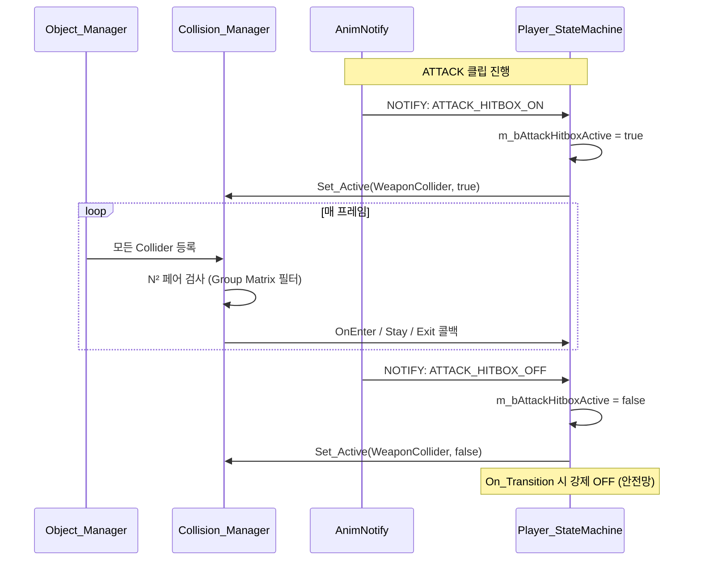
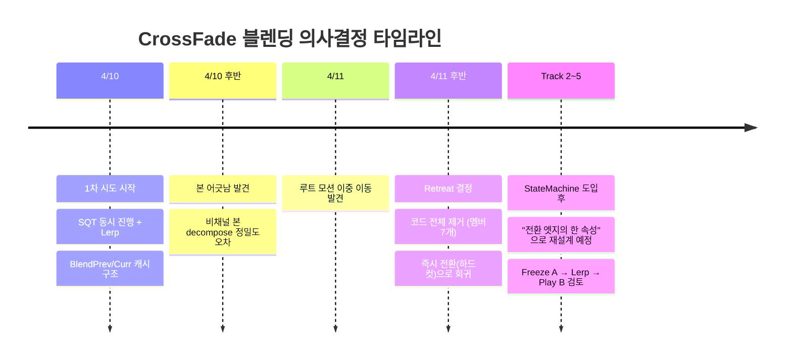

<div align="center">

# Solo Leveling

### DirectX 11 액션 RPG 프레임워크 + 자체 Editor

*솔로 레벨링: 어라이즈 스타일의 보스 전투를, DirectX 11 / C++17 로 직접 설계·구현*

`C++17` · `DirectX 11` · `Effects11` · `Assimp` · `DirectXTK` · `RTTR` · `ImGui` · `ImGuizmo`

— **개발 기간** 2026-03-31 ~ 2026-05-20 (약 7주, 진행 중) — **커밋** 82 — **코드** 약 172k — **명세서** 한국어 14.4k —

</div>

---

## Highlights

<table>
<tr>
<td width="50%">

### 자체 Editor + 외부 라이브러리 격리
- Assimp / RTTR / ImGui / ImGuizmo 를 **Editor.exe 에만** 가둠
- Engine 측 ImGuizmo 통합은 `Set_WorldMatrix` setter **1줄**
- FBX → 자체 바이너리 SLMD 변환 (Editor) → Engine 은 `.bin` 만 fread

</td>
<td width="50%">

### 살아있는 데이터 포맷
- **SLMD v1 → v2 → v3** version 분기 + 누락 필드 폴백
- 같은 패턴을 `.navdata` / `.scene` / `.uiscene` 전부 적용
- 옛 자산을 재변환 없이 살림

</td>
</tr>
<tr>
<td width="50%">

### State × Action × Weapon 3축 분리
- 47 개 애니메이션을 1차원 enum → 3축 lookup 으로 재구성
- `Make_AnimKey(state, action, weapon) → AnimIndex` + 4단계 폴백
- "같은 LMB 입력의 의미가 컨텍스트마다 다름" 을 코드로 표현

</td>
<td width="50%">

### AnimNotify ↔ 충돌 / HUD 결선
- 키프레임에 `ATTACK_HITBOX_ON/OFF` notify 박음
- wrap-aware 발화 → StateMachine → Collision_Manager 활성/비활성
- `On_Transition` 강제 OFF 안전망

</td>
</tr>
<tr>
<td width="50%">

### 게임플레이 결과물
- 추적 카메라 (SpringArm + Style C Yaw 기반 이동)
- 콤보 (BASIC_ATTACK 1~3 Early-Cancel + 0.18s 입력 버퍼)
- 보스 Crash 메커닉 (Break 게이지 0 → 딜 타임 → 재충전)
- HUD 게이지 시스템 (UV clip + Lazy Bar + Sweep 시스템 2종)

</td>
<td width="50%">

### 명세서 + AI 협업 워크플로우
- 14,400 줄의 한국어 명세서 (트랙별 결정 로그 + 함정 카탈로그)
- Claude Code + Codex CLI 페어 프로그래밍
- "결정 → 명세서 → 코드블록 → 사용자 적용 → 함정 명세화" 사이클

</td>
</tr>
</table>

---

## 목차

**프로젝트**
1. [프로젝트 한 줄 요약과 배경](#1-프로젝트-한-줄-요약과-배경)
2. [프레임워크 구조](#2-프레임워크-구조)
3. [트랙별 진행 (Layer 0 ~ Track 5)](#3-트랙별-진행)

**결정과 함정**

4. [설계 단계의 의사결정 (다이어그램 + 학습)](#4-설계-단계의-의사결정)
5. [주요 트러블슈팅 (치명적 / 최적화 부담)](#5-주요-트러블슈팅)

**자료와 방법론**

6. [시각화 자료](#6-시각화-자료)
7. [학습 방법](#7-학습-방법)
8. [AI 사용 방법](#8-ai-사용-방법)

**보조 정보**

9. [빌드 및 실행](#9-빌드-및-실행)
10. [디렉토리 구조](#10-디렉토리-구조)
11. [향후 작업과 회고](#11-향후-작업과-회고)
12. [자산 출처와 라이선스](#12-자산-출처와-라이선스)

---

## 1. 프로젝트 한 줄 요약과 배경

> **"수업에서 배운 3D 프레임워크를, '내가 만들고 싶은 액션 게임' 을 향해 7주간 한 트랙씩 확장한 기록."**

### §1.1 프로젝트 배경

학원의 4-Project Framework 수업이 끝나고, "수업 코드를 그대로 두면 내 것이 아니다" 라는 문제의식에서 시작. 단순히 따라 만드는 것을 넘어 **솔로 레벨링: 어라이즈** 의 보스 전투(딜 타임 메커닉, 콤보, 가드, 추적 카메라)를 직접 구현하면서, 그 과정에서 만나는 모든 결정 / 함정 / 학습을 명세서에 박아두는 것이 목표였다.

핵심 차별점:

| 수업 코드 | 본 프로젝트 |
|---|---|
| Engine 안에 Assimp 직접 사용 | **Editor 만 Assimp**. 런타임은 자체 SLMD 바이너리 |
| 단순 Animation 재생 | **AnimNotify** + 콤보 Early-Cancel + cross-fade 1차 시도/retreat |
| 텍스트로만 진행 사항 | **14,400 줄 한국어 명세서** + Decision Log + 함정 카탈로그 |
| (없음) | **자체 Editor** — ImGui 6 패널 + ImGuizmo + RTTR + 2D Canvas + NavMesh 저작 |

### §1.2 진행 요약

- 학원 수업 (`CPP_STUDY_3D`) 의 4-Project 프레임워크를 출발점으로
- **자체 Editor (ImGui + ImGuizmo + RTTR)** 를 먼저 구축한 뒤
- 그 Editor 위에서 **모델·애니메이션·NavMesh·UI·HUD** 를 저작하면서
- Client 런타임 (`CPlayer`, `CMonster`, `CHUD_GamePlay`) 으로 **솔로 레벨링 풍의 보스 전투** 를 결선해 가는 과정

### §1.3 기술 스택 한눈에

| 분류 | 사용 기술 |
|---|---|
| **언어 / 표준** | C++17, HLSL Shader Model 5.0, Effects11 |
| **그래픽 API** | DirectX 11 (D3D11, DXGI, D3DCompiler) |
| **수학 / 유틸** | DirectXMath, DirectXTK (SpriteFont, BoundingX, BasicEffect, PrimitiveBatch) |
| **저작 (Editor 격리)** | Assimp 5.x, RTTR 0.9.6, ImGui, ImGuizmo |
| **개발 환경** | Visual Studio 2022 (v143), Windows 10 SDK, x64, 동적 CRT |
| **AI 페어 프로그래밍** | Claude Code (Anthropic), Codex CLI |

---

## 2. 프레임워크 구조

### §2.1 4-Project DLL 계층



- **Engine.dll** — D3D 리소스 / 컴포넌트 / 수학 / 충돌 / NavMesh 인프라. 외부 라이브러리 의존 없음.
- **Client.dll** — GameApp 과 Editor 가 공통으로 호스팅하는 게임 로직 DLL. 프로토타입을 등록해 두고, Editor 는 `Clone_Prototype` 으로 가져다 쓴다.
- **Editor.exe** — Assimp / RTTR / ImGui / ImGuizmo 를 **여기에만** 가둠.
- **GameApp.exe** — 순수 런타임. Editor 와 같은 Client.dll 을 쓰지만 ImGui 호스팅 없음.

### §2.2 핵심 디자인 패턴

| 패턴 | 적용 위치 | 효과 |
|---|---|---|
| Singleton (`DECLARE/IMPLEMENT_SINGLETON`) | `CGameInstance`, 각 서브시스템 | 전역 접근 + 명시적 라이프사이클 |
| **Prototype / Clone** | `Add_Prototype` → `Clone_Prototype` | Editor 에서 Client 오브젝트를 안전하게 인스턴스화 |
| **CBase ref counting** (`Safe_AddRef/Release/Delete`) | 모든 Engine 객체 | RTTI 없이 수명 관리, 순환 참조 회피 |
| Descriptor chain | `TRANSFORM_DESC` → `GAMEOBJECT_DESC` → 파생 DESC | 생성자 인자 폭주 방지, 기본값 폴백 |
| **Container / PartObject** | `CPlayer = Body + Weapon`, `CMonster = Body` | 합체형 캐릭터 — 본 매트릭스 합성으로 무기 attach |
| **SSOT (Single Source of Truth)** | `m_WorldMatrix`, `.bin (loop/notify)`, `vMoveDirWorld` | 데이터가 두 곳에 존재하지 않도록 강제 |
| **Polling 동기화** | Inspector RTTR ↔ ImGuizmo ↔ Transform | dirty flag / event 시스템 없이 SSOT 폴링 |

### §2.3 Update / Render Pipeline

```
Input_Device::Update
  └─ Priority_Update             (Camera 등 1순위)
      └─ Update                  (게임 로직 메인)
          └─ PipeLine::Update    (VIEW / PROJ 매트릭스 캐시)
              └─ Late_Update     (Render Group 등록, 카메라 boom, AnimController)
                  └─ Collision_Manager::Update   (페어 검사 + Enter/Stay/Exit)
                      └─ Renderer::Draw          (PRIORITY → NONBLEND → BLEND → UI)
                          └─ DebugDraw → ImGui (Editor) → Present → End_Frame
```

### §2.4 Vertex ↔ Shader 매핑

| Vertex 구조체 | Shader | 용도 |
|---|---|---|
| `VTXTEX` | `Shader_VtxTex` | BackGround / **UI / HUD (게이지 UV clip + Sweep)** |
| `VTXNORTEX` | `Shader_VtxNorTex` | Terrain (Phong) |
| `VTXMESH` | `Shader_VtxMesh` | Static Model (맵, 무기) |
| `VTXANIMMESH` | `Shader_VtxAnimMesh` | Skinned (BoneIndices/Weights, Player/Monster) |
| `VTXPOSCOLOR` | `Shader_VtxPosColor` | NavMesh / DebugDraw 와이어프레임 |

---

## 3. 트랙별 진행

> **계획서의 진화**: `Editor_전체_구현계획.md` (Layer 0~4) → 단계가 늘어나면서 `통합_구현계획.md v1 → v2 → v3` 로 재배열. Player 1차 마감 시점부터 **6 개 트랙** 으로 재구성 (v3, 2026-05-05).

### §3.1 Layer 0 — 공통 인프라 / Editor

> *4월 초 · Editor 6 패널 + ImGuizmo + RTTR + 마우스 피킹*

| 작업 | 결과 |
|---|---|
| Engine API 확장 | 오브젝트/레이어/컴포넌트 getter, DLL export 정비 |
| 6 패널 | Hierarchy / Inspector / Log / ContentBrowser / Shortcuts / Viewport |
| `CPanel_Manager` 순환 참조 해결 | `Release_Panels()` 수동 해제 패턴 |
| RTTR 통합 | `RTTR_Registration.cpp` 에서 CTransform 등록. abstract 등록 가능 / private dtor concrete 등록 불가 |
| 마우스 피킹 | `CPipeLine::Compute_WorldRay` + `CVIBuffer::Pick (TriangleTests::Intersects)` |
| **ImGuizmo 통합** | Engine 측 변경 = `CTransform::Set_WorldMatrix` 인라인 setter **1줄**. 행우선/pre-multiply 가 ImGuizmo 기본 규약과 일치 → transpose 불필요 |
| Editor → Client 런타임 호스팅 | Edit / Play 토글, Loader 재사용 (수동 셋업 → 자동) |

### §3.2 Layer 1 — 모델 / 애니메이션 파이프라인

> *4월 중 · FBX → 자체 SLMD 바이너리 + Assimp 격리*

- **Assimp 격리 (B안)**: Editor 만 Assimp. FBX → `CModel_Converter::Convert()` → **SLMD `.bin`** 저장. Engine/Client 는 `.bin` 만 fread.
- **SLMD 포맷 진화**:
  - **v1** — Header + Mesh + Material + Bone + Animation + Channel
  - **v2** — 퍼-애니메이션 `bIsLoop` / `bUseRootMotion` / `RootBoneName` / `PreTransform`
  - **v3** — `AnimNotify[]` 배열 (`ATTACK_HITBOX_ON/OFF` 등 이벤트 키프레임)
  - **버전 분기 폴백 로드** — v1 .bin 도 v3 로더가 빈 필드로 안전 로드
- **CModel Clone 전략**: `Mesh / Material` = AddRef 공유 / `Bone / Animation` = 깊은 복사
- **Editor 측 변환 함정 정리**: `aiProcess_PreTransformVertices` (NONANIM) / 노드 변환 보존 (ANIM) / `LowMesh/NLOD` 메시 필터링 / DIFFUSE 없을 때 `_CO` suffix 자동 탐색 / Assimp 열우선 → DirectX 행우선 전치

### §3.3 Layer 2 — Player 게임플레이 1차

> *4월 말 ~ 5월 초 · 입력 / 이동 / 콤보 / 가드 / AnimNotify*

- **입력 파이프라인**: `CInput_Device` (Raw Input, 2단계 static→frame, edge-trigger) → `CIntentResolver` (Raw → Intent) → `CPlayer_StateMachine`
- **State / Action / Weapon 3축 분리**: 처음엔 `CHARACTER_ACTION` 단일 평탄화였으나, "같은 입력의 의미가 컨텍스트에 따라 다름" 을 깨닫고 분리. `Make_AnimKey(state, action, weapon)` 3D 룩업 + 4단계 폴백 → 자세한 내용은 [§4.4](#44-player-애니메이션--state--action--weapon-3축-분리) 참조
- **이동 (Style C)**: WASD = 카메라 Yaw 기준 월드 방향벡터. Player 는 목표 방향으로 회전 속도 한계 내 보간 회전 + 동시 전진. Mouse X → Camera Yaw (Player 아님).
- **회전 보간 각도 의존**: ≤ 30° 540°/s (lean 가시) / 30~135° 선형 / ≥ 135° 1440°/s (스냅)
- **공격 콤보**: `BASIC_ATTACK_01/02/03` Early-Cancel + `ComboWindow` Notify + LMB 0.18s 입력 버퍼
- **가드**: `GUARD_START/LOOP/END` Held 기반 + RMB flicker 0.10s 디바운스 + Reject (DASH→GUARD)
- **AnimNotify 인프라**: `INotifyListener::OnNotify(NOTIFY_EVENT)` Listener pass-through (Body→AnimController→Model→`CAnimation::Tick_Notifies`, wrap-aware)

### §3.4 Track 1 — 추적 카메라 + Style C 이동 정책 마감

> *5월 초 · SpringArm + Yaw 기반 월드 이동*

- `Camera_Follow` + `SpringArm` 즉시 추적 + 충돌 복귀용 Distance Lerp 확장점 (Boom 식 트레이스는 Track 4 이후)
- Pitch / Yaw 쿼터니언 합성 순서 함정 → [§4.3](#43-카메라--spring-arm--style-c-yaw-기반-월드-이동) / [§5.7](#57-camera_follow-target-dangling)
- **누적 vs 재구성**: `m_fYaw / m_fPitch` 를 스칼라 SSOT 로 두고 매 프레임 q 재구성 (누적식은 부동소수점 오차 축적)
- **Camera target dangling 1차 해결**: `Layer_Player` 자동 검색/재바인딩으로 Player 삭제/재생성 시 크래시 회피

### §3.5 Track 2 — NavMesh + Scene I/O v1

> *5월 7 ~ 11일 · 수동 셀 편집 + 공유 정점 풀 + Scene I/O 인프라*

- 수업 코드 (9개월차) `CNavigation / CCell` 참고하되, **공유 정점 풀 + 자동 Winding 보정** 으로 자체 구현
- **편집 워크플로우**: Editor `NavMesh Edit Mode` → 맵 표면 Raycast → 스냅 → 3 정점 모이면 `(B-A) × (C-A).y` 부호로 Winding 통일 → Neighbor 전체 재계산
- **Undo/Redo**: NavMesh 전체 Snapshot push (Command delta 가 아닌 Snapshot — 규모 작아 단순함 우선)
- **NavData v1**: `SLNM` magic + version + vertex 배열 + Cell vertex index 배열. Neighbor 는 로드 후 재계산
- **Scene I/O v1**: `SCENE_DATA = NavData 경로 + SPAWN_POINT 배열`. SpawnPoint 타입 = `PLAYER / MONSTER_NORMAL/ELITE/BOSS`
- **CNavigationAgent** 컴포넌트: Player/Monster 가 `Add_Component` 로 보유. NavMesh 는 Layer lookup → 장기 보관 멤버라 `Safe_AddRef/Release`

### §3.6 Track 3 — Font + 2D UI Editor

> *5월 11 ~ 15일 · Logo / Loading / HUD 인프라*

- **Font**: 수업 코드 `CFont_Manager / CCustomFont` (DirectXTK SpriteFont) Engine 이식
- **2D Canvas 패널**: Editor `Panel_2DCanvas` 신규 — 게임 해상도 기준 직교 투영, UI 오브젝트 드래그/리사이즈/정렬 가이드
- **UISceneLoader / UISceneSerializer**: `.uiscene` 바이너리 + version 분기. UI_ELEMENT 추가 시 v4 → v5 → v6 → v7 자동 마이그레이션
- **CUI_Image / CUI_Text**: Center/Size/UV/Color/SweepMode 멤버 + Set/Get 셋. PASS 분기 (UI=1, SpriteAnim=2, Sweep=3, SweepGlow=4)
- **Logo / Loading Level**: 비디오 텍스처 인프라 + 한글 폰트 (`Font_HeaderKR`) + Loading 동적 게이지 (UV clip)

### §3.7 Track 4 — 충돌 시스템

> *5월 15 ~ 18일 · Bounding + Group Matrix + AnimNotify Hitbox*

- **Bounding 추상 + AABB/OBB/Sphere**: DirectXTK `BoundingX` 래핑. `CCollider (COLLIDER_DESC)` 가 desc 로 어떤 도형이든 생성
- **Collision_Manager** (Renderer 패턴 미러): 매 프레임 collider 등록 → N² 페어 검사 → Enter/Stay/Exit 콜백 (prev/curr set diff) → End_Frame swap + clear
- **DebugDraw**: MS 공식 샘플 이식. `BasicEffect + PrimitiveBatch + CommonStates` 와이어프레임
- **CollisionGroup 매트릭스**: `PLAYER_BODY / PLAYER_ATTACK / MONSTER_BODY / MONSTER_ATTACK / MAP_STATIC` + `Set_CollisionMatrix(A, B, true)` 양방향 활성
- **AnimNotify ↔ Hitbox 연결**: `ATTACK_HITBOX_ON/OFF` notify → `m_bAttackHitboxActive` 토글 → Weapon collider 활성/비활성. `On_Transition` 강제 OFF 안전망
- **무기 OBB**: `FX_Point_L/R_Weapon` 본 캐싱 + 매 프레임 본 World × LocalAttachMatrix

### §3.8 Track 5 — Monster + HUD + 잔여 Player

> *5월 18 ~ 20일, 진행 중 · Boss 본체 / 데미지 라우팅 / HUD 시스템 / Boss AI 1차*

#### Monster 본체 + Break + Crash / Death 액션 전이

- `CMonster (Container) ← CBoss_Monster + CNormal_Monster + CElite_Monster` 골격
- **이중 풀 데미지 라우팅**:
  | Break 상태 | HP 배율 | Break 배율 |
  |---|---|---|
  | Break 없음 (Normal/Elite) | × 1.0 | — |
  | Break 보유 + Break > 0 | × 0.7 | × 1.5 |
  | Break 보유 + Break = 0 (Crash 진행) | × 1.5 (딜 타임) | — |
- **Crash 종료** = 타이머 (기본 3초) + `On_ActionFinished() + Try_Action(IDLE)` 패턴 → Engine `Force_Transition` 신설 폐기 (Player_StateMachine 동일 패턴 미러 → 일관성)
- **HP 0 → DEATH** + Priority 10 > 5 자동 우선

#### HUD 시스템 (#6-7 ~ #6-10)

- **게이지 = UV clip 셰이더** (mesh sx 축소 폐기): `Shader_VtxTex.PS_UI` 에 `g_fGaugeProgress` uniform + `texcoord.x > progress` discard
- **Lazy Bar (Reduce)**: Fill 즉시 감소 + Reduce 1초 Hold 후 0.6/s 로 따라잡음. ZOrder: Back < Reduce < Fill
- **HUD_GamePlay = GameObject singleton**: `CGameObject` 상속 + `s_pInstance` + AddRef (Layer Free 자동 통합)
- **Visibility 2단계 게이트 + Timer**:
  ```
  [Sleep] timer=0, invisible
     ↓ Notify_DashInput / CombatInput
  [Active] visible, timer counting
     ↓ timer >= threshold (Dash 2.5s / Bars 4s)
  [Sleep]
  ```
- **Dash UI = 월드 빌보드**: Player `Pivot_Chest` 본 World → View × Proj → NDC → Screen + 발치 오프셋 `(-105, +65) × (ViewW/1280, ViewH/720)`
- **Sweep 시스템 2 종**:
  - **BarLight = Position-sweep**: mesh CenterX 가 Fill 비율 내에서 좌→우 이동. 1.5s sweep + 1.0s 휴식
  - **Glow = UV-band mask**: 텍스처 위치 고정, 셰이더에서 `abs(texcoord.y - bandCenter)` + `smoothstep` band fade
- **PASS SSOT**: 0=Default / 1=UI / 2=SpriteAnim / **3=Sweep / 4=SweepGlow**

#### Boss AI 1차 (거리별 패턴)

- `CMonster::Tick_AI(fTimeDelta)` — `m_fMeleeRange / m_fMidRange / m_fLongRange` 거리 분기로 `BASIC_ATTACK_01 / SKILL_03 / SKILL_05` 선택
- `m_pTarget = CGameObject*` 캐시 (Safe_AddRef/Release) + `MONSTER_DESC.pTarget` 주입 + `Resolve_Target()` Layer fallback
- **Is_AIActionLocked**: 공격 / 스킬 / Crash / Death 중 AI 중복 트리거 방지

---

## 4. 설계 단계의 의사결정

> 한 트랙을 시작할 때마다 **개념 → 대안 비교 → 본 프로젝트 적용** 순으로 명세서에 박았다. 아래는 "결정의 무게" 가 큰 **7 가지**. 각 항목에 다이어그램 + 트레이드오프 + 학습 포인트가 함께 들어 있다.

### §4.1 외부 라이브러리 격리 = Editor 전용

> 가장 큰 아키텍처 결정.

수업 코드는 Engine 안에 Assimp 가 있다. 본 프로젝트는 **Assimp / RTTR / ImGui / ImGuizmo 를 Editor.exe 안에만 가둔다**.



| 라이브러리 | 대안 | 선택과 이유 |
|---|---|---|
| **Assimp** | (A) Engine 통합 (수업 코드) <br> (B) Editor 전용 + 자체 바이너리 | **B 채택**. 런타임은 `.bin` 만 fread. Engine 의 빌드 시간 / 의존성 / 배포 크기가 작아짐. SLMD 포맷이 SSOT. |
| **RTTR 0.9.6** | (A) Engine 내장 <br> (B) macro 자체 reflection <br> (C) Editor 외부 등록 | **C 채택**. `RTTR_Registration.cpp` 한 파일에서 멤버 함수 포인터 등록. Engine 코드 무변경. |
| **ImGui / ImGuizmo** | (A) Engine hook 다수 <br> (B) Editor 격리 + 행렬 setter 1줄 | **B 채택**. Engine 측 변경 = `Set_WorldMatrix` 인라인 setter **1줄**. DirectX 행우선 + pre-multiply 가 ImGuizmo 기본 규약과 일치. |

**왜 이게 큰 결정인가**:
- Engine 의 빌드 시간 / 의존성 / 배포 크기가 작아진다
- 같은 `.bin` 을 GameApp / Editor / 다른 환경 모두 동일하게 로드
- 외부 lib 가 깨져도 런타임은 영향 없음 (저작 단계만 영향)

> **공부한 것**
> - **DLL export 경계** (`ENGINE_DLL` / `CLIENT_DLL` 매크로) 와 헤더 분리 — public API 만 노출
> - **Prototype / Clone 패턴** — Editor 가 Client 의 GameObject 를 안전하게 인스턴스화하는 핵심
> - **RTTR 메타프로그래밍** — 멤버 함수 포인터 등록, abstract 등록 가능 / private dtor concrete 등록 불가
> - **번역 단위 매크로 격리** — `#define new DBG_NEW` 가 외부 lib 와 충돌하지 않게 include 순서 통제

---

### §4.2 모델 파이프라인 = SLMD 바이너리 + Version 분기 폴백

Editor 가 FBX 를 받아 자체 포맷 `.bin (SLMD)` 으로 변환하고, Engine 은 `.bin` 만 안다.



**SLMD 포맷의 진화** (포맷 자체가 살아있는 데이터):

| 버전 | 추가 필드 | 동기 |
|---|---|---|
| v1 | Header + Mesh + Material + Bone + Animation + Channel | 기본 |
| v2 | 퍼-애니메이션 `bIsLoop` / `bUseRootMotion` / `RootBoneName` / `PreTransform` | 루트 모션 / 루프 토글 데이터화 |
| v3 | `AnimNotify[]` 배열 (`ATTACK_HITBOX_ON/OFF` 등) | 이벤트 키프레임 도입 |

**Version 분기 폴백 패턴** — 핵심:

```cpp
fread(&iVersion, ...);
if (iVersion >= 2) { fread(&bIsLoop, ...); fread(&bUseRootMotion, ...); }
else                { bIsLoop = false; bUseRootMotion = false; }  // v1 폴백

if (iVersion >= 3) { fread(&iNotifyCount, ...); /* notify 배열 */ }
else                { iNotifyCount = 0; }
```

→ **v1 .bin 도 v3 로더가 빈 필드로 안전 로드**. 자산 재변환 강제하지 않음.

**Clone 전략**: `Mesh / Material` = AddRef 공유, `Bone / Animation` = 깊은 복사. 같은 캐릭터 인스턴스 100 개 만들어도 정점/텍스처는 공유, 본/애니 진행도는 각자.

> **공부한 것**
> - **바이너리 직렬화 vs JSON** — KEYFRAME 같은 대용량 POD 배열은 일괄 `fread` 가 빠른 경로
> - **포맷 versioning + 폴백** — 자산이 한번 만들어지면 다시 만들기 비싸다. version 분기로 옛 파일을 살림
> - **DBG_NEW 매크로 호환 패턴** — `::operator new` 금지, `new _ubyte[size]` 우회
> - **Assimp 처리 옵션** (`aiProcess_PreTransformVertices`, 노드 변환 보존) — NONANIM 과 ANIM 의 분기

---

### §4.3 카메라 = Spring Arm + Style C (Yaw 기반 월드 이동)



**카메라 대안 비교**:

| 후보 | 장점 | 단점 | 선택 |
|---|---|---|---|
| Direct Follow (`Cam = Target + Offset`) | 단순, 즉각 | 끊김, 빠른 회전 시 어지러움 | ✗ |
| **Spring Arm + 즉시 추적 + Distance Lerp 확장점** | 부드러움, 액션 조작감 안정, 충돌 복귀 가능 | 튜닝 필요 | ✓ |
| Boom (Unreal) | 벽 뒤로 카메라 안 들어감 | 충돌 트레이스 비용. Track 4 이후 가능 | 후속 |
| Cinemachine 식 (데드존/락온/우선순위) | 영화적 표현 | 본 프로젝트 규모엔 과함 | ✗ |

**Yaw 획득 방식** — Pull vs Push:

| 후보 | 평가 |
|---|---|
| Camera 직접 참조 (`dynamic_cast`) | ✗ 커플링 높음, Camera_Follow 교체 시 깨짐 |
| **PipeLine Pull** (`GameInstance::Get_Transform(VIEW)`) | ✓ 커플링 0, 매 프레임 유효한 상태 질의 |
| Camera Notify Push | ✗ Pull 을 흉내내는 이벤트, 안티패턴 |

→ **Yaw 는 매 프레임 유효한 상태이므로 Pull 이 정석.** 이벤트로 포장할 게 아님.

**Style C 이동 정책**: WASD = 카메라 Yaw 기준 월드 방향벡터. 비락온 한정 **스트레이프 없음** (A/D 는 좌우 측면이 아니라 "왼쪽/오른쪽으로 달리며 회전").

> **공부한 것**
> - **쿼터니언 vs 오일러 vs 행렬** — 자유도, 짐벌락, 각 표현의 장단
> - **누적 vs 재구성** — 스칼라 SSOT 에서 매 프레임 q 재계산. 누적식은 부동소수점 오차 축적
> - **DirectXMath 함수의 인자 순서가 수학 표기의 역순** — `XMQuaternionMultiply(qA, qB)` 는 수학식 `qB * qA`
> - **Pull vs Push 패턴 선택 기준** — "매 프레임 유효한 상태" 는 Pull, "1회 발생 이벤트" 는 Push

---

### §4.4 Player 애니메이션 = State / Action / Weapon 3축 분리

처음엔 `CHARACTER_ACTION` 1차원 enum 으로 시작했다. 47 개 애니메이션을 평탄화하니 **"같은 입력의 의미가 컨텍스트마다 다르다"** 는 문제가 생겼다.



**3 축의 의미**:
- **State** — 입력 차단이 아니라 **"같은 입력의 의미 차별화 컨텍스트"** (LOCOMOTION / COMBAT / GUARD 의미 분류)
- **Action** — 애니메이션 + 1회성 이벤트 (`BASIC_ATTACK_01`, `DASH`, `GUARD_START` 등)
- **Weapon Type** — 클립 베리언트 선택 (`DUAL_BLADE` / `UNARMED` / `END` = wildcard fallback)

**Make_AnimKey 3D 룩업**: `Make_AnimKey(state, action, weapon) → AnimIndex`. 매칭 실패 시 **4단계 폴백** (weapon=END → action=END → state=END → IDLE).

**왜 3축인가**:
- State 분리 → "이동 중 LMB" 와 "콤보 중 LMB" 의 의미가 다름을 표현
- Weapon 분리 → 같은 Action 도 무기에 따라 다른 클립 (Fighter_Idle vs Dualwield_Idle)
- 폴백 체인 → 일부 무기에 클립이 없어도 안전

> **공부한 것**
> - **게임 상태머신 (FSM) 의 컨텍스트 의존성** — "입력 → 상태 전이" 의 의미가 현재 상태에 따라 변한다
> - **AnimNotify 이벤트 패턴** — 키프레임에 이벤트를 박고, 클립 진행 중 wrap-aware 발화
> - **입력 버퍼링 / 디바운싱** — 콤보 윈도우 0.18s 버퍼, RMB hold 0.10s 디바운스
> - **이름 짓기의 중요성** — `CHARACTER_ACTION` → `STATE × ACTION × WEAPON` 분리하자마자 설계가 자명해짐

---

### §4.5 NavMesh = 수동 편집 + 공유 정점 풀 + Snapshot Undo



| 방식 | 채택 | 이유 |
|---|---|---|
| Recast / Detour 자동 생성 | ✗ | 라이브러리 의존, 학습 목적과 거리 멈 |
| **수동 셀 편집 + Picking + 공유 정점 풀** | ✓ | 의존 0, 제어 완전, 정점 드래그 시 인접 Cell 같이 변형 |
| 그리드 / 4·8 방향 노드 | ✗ | 자유 형태 표현 어려움, 대각선 비용 부정확 |
| Voronoi | ✗ | 구현 복잡, 본 프로젝트 규모에 과함 |

**핵심 결정** — **공유 vs 비공유 정점**: 공유 시 인접 그래프 자동 계산 + 정점 1개 수정이 여러 Cell 영향 / 비공유 시 인접은 좌표 비교 필수 + 영향 격리. **공유 선택**.

**편집 워크플로우**:
1. Picking → 맵 표면 좌표 채택
2. 스냅 (반경 내 기존 정점 ID 재사용)
3. 3 정점 모이면 `(B-A) × (C-A).y` 부호로 **Winding 자동 보정** (어느 순서로 찍어도 CCW)
4. Neighbor 전체 재계산 (같은 정점 ID 2개 공유 = 인접)
5. **Snapshot 기반 Undo/Redo** (Command delta 가 아니라 NavMesh 전체 스냅샷 — 규모 작아 단순함 우선)

**저장 포맷** (`.navdata`): `SLNM magic + version + vertex 배열 + Cell vertex index 배열`. Neighbor 는 저장 안 하고 로드 후 재계산 (정합성 보장).

> **공부한 것**
> - **그래프 자료구조** — 정점 풀 + 인접 리스트, Neighbor 가 양방향
> - **Cross product 의 .y 부호로 winding 판정** — `(B-A) × (C-A)`, y > 0 이면 CCW (위에서 봤을 때)
> - **A\* 탐색** (Track 5 에서 이식 예정 — 셀 중심 간 Euclidean 휴리스틱)
> - **Snapshot vs Command Delta Undo 트레이드오프** — 데이터 규모와 작업 복잡도에 따라 선택

---

### §4.6 충돌 시스템 = Bounding + Group Matrix + AnimNotify 연결



**Bounding 추상화**:
- `Bounding` (추상) ← `Bounding_AABB`, `Bounding_OBB`, `Bounding_Sphere` (DirectXTK `BoundingX` 래핑)
- `CCollider (COLLIDER_DESC)` 가 desc 하나로 어떤 도형이든 생성

**Collision_Manager — Renderer 패턴 미러**:
- 매 프레임 collider 등록 → N² 페어 검사 → Enter/Stay/Exit 콜백 (prev/curr set diff)
- End_Frame 에서 swap + clear (다음 프레임 새로 등록)
- **왜 N² 인가**: 본 프로젝트 규모 (Player + Boss + 부속 ~ 10 collider) 에서 broad phase 불필요. Spatial Hash / BVH 는 객체 100 개 이상에서 의미 있음

**CollisionGroup 매트릭스**:

```
                BODY  ATTACK  MAP
PLAYER_BODY      ✗     ✓ M    ✓
PLAYER_ATTACK    ✓ M   ✗      ✗
MONSTER_BODY     ✓ M   ✓ P    ✓
MONSTER_ATTACK   ✓ P   ✗      ✗
MAP_STATIC       ✓     ✗      ✗
```

→ `Set_CollisionMatrix(PLAYER_BODY, MONSTER_BODY, true)` 식으로 양방향 활성. 같은 그룹끼리는 비활성 (모든 Player-self 충돌 회피).

**AnimNotify ↔ Hitbox 연결** (가장 큰 결선):
- ATTACK 클립의 키프레임에 `ATTACK_HITBOX_ON` / `OFF` notify 박음
- 클립 진행 중 wrap-aware 발화 → StateMachine 의 `m_bAttackHitboxActive` 토글
- Weapon collider 의 활성/비활성 → Collision_Manager 의 페어 검사에서 제외
- `On_Transition` 시 강제 OFF (안전망 — 클립 중단 시 hitbox 누락 방지)

> **공부한 것**
> - **AABB / OBB / Sphere 의 trade-off** — AABB 빠르지만 회전 표현 못 함, OBB 정확하지만 비용 ↑, Sphere 회전 무관
> - **DirectXTK BoundingX API** — `Contains`, `Intersects`, `Transform` 의 의미와 좌표계
> - **이벤트 발화 모델 (AnimNotify wrap-aware)** — loop 클립에서 발화 누락 / 중복 발화 방지
> - **Group Matrix 패턴** — Unity LayerCollisionMatrix 의 의미와 본 프로젝트 적용

---

### §4.7 애니메이션 블렌딩 = 의사결정으로서의 retreat

가장 큰 의사결정 사례. **"안 되는 걸 일찍 인정한다"** 의 가치.



**처음 시도**: SQT 동시 진행 + Lerp + `XMMatrixDecompose → XMMatrixAffineTransformation` 라운드트립

**터진 것**:
- 비채널 본까지 decompose/recompose → 부동소수점 오차 누적 (영구 변형)
- 루트 본 Translation 키프레임 있으면 A/B 동시 전진 → 월드 이중 이동
- 구조 복잡도 폭발 (멤버 7개, Dirty Mask 필요)

**Retreat 결정** — 일주일 작업분을 들어냈다. 이유:
- 블렌딩은 **"언제 어떻게 전환할 것인가"** 의 고수준 제어 (StateMachine, 전환 조건) 와 떼어 설계하면 재작업 가능성 크다
- 즉시 전환(하드 컷)으로도 Editor 프리뷰는 충분
- StateMachine 도입 후 "전환 엣지의 한 속성" 으로 자연스럽게 녹임

**의사결정의 핵심**: 구현 가능 ≠ 구현 가치. 유지보수 비용까지 본 결정.

> **공부한 것**
> - **행렬 분해의 한계** — `XMMatrixDecompose` 는 SVD 기반, 정밀도 손실 불가피. 본 transform 은 원본 행렬을 유지해야 안전
> - **의존성 분석** — "블렌딩이 StateMachine 에 의존하는가" 같은 상위 의존성을 보는 눈
> - **technical debt 관리** — 안 되는 걸 일찍 인정하는 것이 최선의 최적화

---

### §4.8 중점 학습 주제 종합

| 영역 | 주제 | 학습 출처 | 본 프로젝트 적용 |
|---|---|---|---|
| **3D 수학** | 좌표계 (LH/RH), 행렬 합성, 쿼터니언, 짐벌락, Slerp | 학원 수업 (3D 회전 이론 Ch.1~4) + DirectXMath 문서 | Camera Pitch/Yaw, Player 회전 보간, ImGuizmo 행우선 호환 |
| **DirectX 11** | 디바이스/컨텍스트 분리, Effect cbuffer, HLSL SM 5.0, RenderState, BlendState | 학원 수업 + Frank Luna *Introduction to 3D Game Programming with DirectX 11* | Renderer, Shader_VtxTex/Mesh/AnimMesh/PosColor, UV clip 게이지 |
| **게임 아키텍처** | Singleton, Prototype/Clone, CBase ref counting, Descriptor chain, Component | 학원 수업 4-Project Framework | Engine 전반, Editor 의 Client 호스팅 |
| **상태머신 / 입력 모델링** | FSM, 컨텍스트 의존 입력 해석, Input buffering, Edge-trigger | 자체 설계 + *Game Programming Patterns* 일부 | Player_StateMachine, IntentResolver, AnimNotify |
| **애니메이션 시스템** | Skeletal animation, Skinning, Root motion, AnimNotify, Blend tree (보류) | 학원 수업 (9 ~ 14일차) + 1차 CrossFade 시도 + retreat | CModel / CAnimation / CChannel, AnimController |
| **충돌 / 자료구조** | AABB/OBB/Sphere, broad phase / narrow phase, Group Matrix | DirectXTK 샘플 + *Real-Time Collision Detection* 일부 | Collision_Manager, Bounding 추상, AnimNotify-hitbox 연결 |
| **NavMesh / 그래프** | 셀 표현, 공유 정점, Winding, Neighbor 그래프, A\* (예정) | 학원 9개월차 NavMesh 수업 + 자체 확장 | CNavMesh, CNavigationAgent, Editor 저작 UI |
| **데이터 직렬화** | 바이너리 vs JSON, version 분기 폴백, POD 일괄 fread | 자체 설계 (수업 코드에 없음) | SLMD v1→v3, .navdata, .scene, .uiscene |
| **Editor 저작 도구** | ImGui Immediate Mode, ImGuizmo manipulator, RTTR reflection, Panel 도킹 | ImGui 공식 데모 + RTTR 0.9.6 docs | 6 패널 + Panel_Manager, ImGuizmo 통합 (setter 1줄) |
| **자산 파이프라인** | Assimp 처리 옵션, FBX node hierarchy, AssetStudio dynamic bone 추출 | Assimp docs + 자체 SLMD parser 제작 | CModel_Converter, parse_slmd.py |
| **AI 페어 프로그래밍** | 결정 로그 작성, Sub-agent 컨텍스트 보호, 명세서 기반 합의 | 자체 워크플로우 수립 | CLAUDE.md 정책, `명세서/통합_구현계획_v3.md` Decision Log |

> **학습 방식의 공통점** — *수업/책 → 자기 언어로 명세서에 재정리 → 본 프로젝트 제약에 맞춰 재설계 → 코드 작성 → 함정 발견 → 명세서에 함정 추가* 사이클. 같은 주제를 두 번 공부하지 않게 만드는 게 핵심.

---

## 5. 주요 트러블슈팅

> 단순 오타 · 명명 컨벤션 · 필드 전파 누락 같은 사소한 함정은 제외하고, **크래시 · 게임 진행 차단 · 구조 폭발 · 드라이버 의존** 처럼 한 시간 이상 잡아먹은 사례만 정리.

### §5.1 1차 CrossFade 애니메이션 블렌딩 → 보류 / 재설계

> *4/10 → 4/11 · 일주일 작업분을 들어내고 다시 그림*

- **시도한 방식**: 두 클립의 SQT (Scale/Quaternion/Translation) 를 동시 진행하며 weight lerp. `XMMatrixDecompose → XMMatrixAffineTransformation` 라운드트립으로 본 transform 재구성
- **터진 증상**:
  1. **비채널 본까지 decompose/recompose** → 부동소수점 오차가 매 프레임 누적 → **본 어긋남 (모델 일그러짐)**
  2. 한쪽 클립에만 채널이 있는 본은 블렌드 종료 후에도 잘못된 재구성 행렬이 잔존 → 영구 변형
  3. 루트 본 Translation 키프레임이 있는 클립은 A/B 동시 전진 → **월드 위치 이중 이동**
  4. 구조 복잡도 폭발: `BlendPrev/Curr SQT`, `BindPose 캐시`, `Update_SQT`, `Dirty Mask` 가 계속 늘어남
- **결정**: 코드 전체 들어냄 (멤버 7개, Inspector 블렌드 UI 모두 제거). 즉시 전환(하드 컷) 으로 회귀
- **재설계 방향** (재시도 시 적용):
  - **비채널 본은 절대 decompose/recompose 시키지 말 것** — aiNode 의 `m_TransformationMatrix` 원본 유지
  - **Freeze A → Lerp → Play B** — 동시 재생보다 구조 단순 + 루트 모션 이중 이동 없음
  - StateMachine 도입 후 "전환 엣지의 한 속성" 으로 자연스럽게 녹임
- **배운 점**: 블렌딩은 "**언제 어떻게 전환할 것인가**" 의 고수준 제어와 떼어놓고 설계하면 재작업 가능성이 매우 큼. 일주일 일찍 retreat 했어야 한다.

---

### §5.2 Dash 진입 시 약 0.25m 점프 — Cross-fade ↔ Root Motion 핸드오버

> *4/28 · 치명적 게임 느낌 결함*

- **증상**: 마우스 우클릭 + Space (DASH) 입력 시, 시작 첫 프레임에 약 0.25m 의 의도치 않은 worldspace 점프 발생. 정규 dash 거리 + 점프 거리 합쳐서 너무 멀리 감
- **원인 추적**:
  - DASH 전이 시 Cross-fade 블렌드 (To 트랙) 가 dash 클립을 진행하면서 **자체 prev/curr 루트 본 delta 를 누적** 중
  - 블렌드 완료 시점에 정규 RM 경로로 핸드오프되는데, 정규 경로의 `m_bRootMotionInitialized = false` → **prev 좌표를 새로 캡처**
  - 블렌드 중에 이미 dash 트랙이 50% 진행 → 정규 경로 prev 가 캡처된 시점과 첫 정규 tick 사이의 delta 가 **누적된 50% 분량으로 한꺼번에 적용**
- **해결 (Fix B)**: Blend 완료 시 **To 측이 추적해 온 prev / initialized 상태를 정규 경로에 핸드오버**. 정규 경로의 첫 tick 은 To 측이 끝낸 좌표에서 이어 받음 (재초기화 금지)
- **배운 점**: 멀티 클립 시스템은 각 클립의 상태를 분리 추적하되 **전환 시점에 일관되게 인수인계** 해야 한다. "재초기화하면 안전하다" 는 안티패턴 — 누적값이 있는 상태에서 재초기화는 곧 데이터 손실.

---

### §5.3 OverDrive 모델 Dynamic Bone 평탄화 — 자산 파이프라인 차단

> *4/27 · 모델 추출 일주일 막힘*

- **증상**: AssetStudio 로 추출한 `SungJinWoo_OverDrive` 모델의 의상 본 (`Bone_Skirt_*`, `Bone_Coat_*`, 망토 본) 이 **모두 floor 에 평탄하게 고정**
- **원인**: 원본 게임 (Solo Leveling Arise) 은 의상에 **Unity dynamic bone 시뮬레이션** 사용. dynamic bone 본 그룹은 `Bip001` 계층이 아니라 **별도 `Dyanamic EMPTY` GameObject 트리** 로 운영. AssetStudio 가 추출 시 이 dual hierarchy 를 **평탄화 → 모든 본을 sibling 으로 export** → Bip001 의 root motion 이 의상 본에 전파 안 됨
- **해결**:
  1. 자체 SLMD parser (`parse_slmd.py`) 로 본 트리 dump → 의상 본 부모가 EMPTY 확인
  2. AssetStudio 추출 옵션에서 **Dynamic 본 그룹 제외** 활성화 → 상위 Bip001 계층만 export
  3. SLMD 변환 후 재검증, root motion 정상 적용 확인
- **배운 점**: 원본 게임의 **본 시뮬레이션 구조까지 이해** 해야 한다. 추출 도구는 메타데이터를 100% 보존하지 않는다 — **자체 분석 도구** (parser, 본 트리 dump, root motion 검증기) 를 갖춰야 자산 단계에서 시간 안 잡아먹힘.

---

### §5.4 CTexture / CVIBuffer Clone — `combase.dll` 크래시

> *D3D 리소스 수명 함정 · 콜스택이 안 도와주는 종류*

- **증상**: 같은 텍스처를 사용하는 두 번째 GameObject 가 생성되거나 첫 번째가 해제되는 순간 **`combase.dll` 안에서 크래시**. 콜스택은 D3D11 internal 만 나옴
- **근본 원인 1 — CTexture Clone**: `CTexture` 의 복사 생성자가 `vector<ID3D11ShaderResourceView*>` 를 얕은 복사. 두 인스턴스가 같은 SRV 포인터를 가리키지만 ref count 는 1. 한 쪽이 Free 하면 SRV 가 Release 되고, 다른 쪽이 Bind 하는 순간 dangling
- **해결 1**: 복사 생성자에서 SRV 배열 순회 + 각각 `Safe_AddRef()`. RefCount = 인스턴스 수
- **근본 원인 2 — CVIBuffer Clone**: 마우스 피킹용 `PICK_DATA` 가 얕은 복사. 두 인스턴스가 같은 정점 배열을 가리킨 채 각자 Free → `delete[]` 두 번 → 이중 해제 크래시
- **해결 2**: 깊은 복사 (`new + memcpy`) + `Free()` 에서 `Safe_Delete_Array`
- **배운 점**: D3D 리소스는 **CBase ref counting 위에 D3D 자체 ref count 가 또 있는 이중 구조**. Clone 시 두 ref count 가 모두 정합되게 유지해야 함. 콜스택이 안 도와줄 때는 **수명 다이어그램** 부터 그리고 시작.

---

### §5.5 DBG_NEW 매크로 ↔ ImGui / RTTR — 빌드 차단

> *4/3, 4/4 · Editor 통합 진입을 막은 사건*

- **증상**: Editor 프로젝트에 ImGui 또는 RTTR `registration.h` 를 include 하는 순간 **수십~수백 개의 컴파일 오류 폭발**. 메시지는 `placement new` / `operator new` / template 관련
- **원인**: `Engine_Defines.h` 의 `#define new DBG_NEW` (CRT debug heap 추적 매크로) 가 외부 헤더 안의 `placement new` 표현식, RTTR 의 template 메타프로그래밍 패턴과 충돌. 매크로가 토큰 단위로 들어가서 `operator new (size, ptr)` 형태와 시그니처가 안 맞음
- **해결**:
  1. 외부 헤더 include 전에 `#undef new` → 헤더 처리 후 다시 `#define new DBG_NEW` 복구. include 순서 엄격히 관리
  2. RTTR `registration.h` 는 항상 Engine 헤더보다 먼저 include
  3. Engine 코드에서 `::operator new` / `::operator delete` 사용 금지
  4. `void*` 바이트 버퍼는 `new _ubyte[size]` / `delete[] static_cast<_ubyte*>(ptr)` 우회
- **배운 점**: 메모리 추적 매크로는 **번역 단위 (translation unit) 경계에서 격리** 해야 한다. 외부 lib 가 가져오는 함수 시그니처를 매크로가 깨면 디버거 도움 없이 컴파일러 메시지만으로 추적하는 게 매우 힘듦.

---

### §5.6 HLSL cbuffer 16-byte 정렬 — 드라이버 의존 시각 결함

> *HUD #6-10, 5/20 · 일부 환경에서만 발생 → 발견까지 두 시간*

- **증상**: HUD Glow 텍스처의 UV 가 흘러야 하는데 **일부 드라이버에서 정지**. C++ 측 값은 매 프레임 갱신 확인되지만 셰이더에서는 갱신 안 됨
- **원인**: 1차 코드:
  ```hlsl
  float2 g_vUVOffset;  // HLSL
  ```
  ```cpp
  _float2 m_vUVOffset;
  pShader->Bind_RawValue("g_vUVOffset", &m_vUVOffset, sizeof(_float2));  // 8 byte
  ```
  HLSL Effect cbuffer 는 **16-byte 슬롯 정렬** 강제. `float2` 는 슬롯에 8 byte 만 채워지지만 슬롯 자체는 16 byte. `SetRawValue(offset, data, 8)` 호출 시 일부 드라이버는 16-byte 슬롯을 캐시 무효화하지 않고 이전 값 유지
- **해결**:
  ```hlsl
  float4 g_vUVOffset;  // xy 만 사용
  ```
  ```cpp
  _float4 m_vUVOffset;
  pShader->Bind_RawValue("g_vUVOffset", &m_vUVOffset, sizeof(_float4));  // 16 byte
  ```
- **배운 점**: **HLSL cbuffer Bind_RawValue 는 항상 16-byte (float4) 단위로 보낸다**. `float2 g_X` 를 보면 무조건 `float4 g_X` + `.xy` 로 바꾸는 게 안전. 드라이버 의존 결함은 한 환경에서만 발견되므로 정렬을 spec 으로 박는 게 정답.

---

### §5.7 Camera_Follow target dangling — Player 삭제 / 재생성 크래시

> *Editor 의 Edit 모드에서 Player 삭제 → Play 모드 진입 시 즉시 크래시*

- **증상**: Hierarchy → Player 우클릭 → Delete → Play 토글 → **즉시 Access Violation (`Camera_Follow::Update`)**. 콜스택은 `XMVector3Transform` 안
- **원인**: `CCamera_Follow::m_pTargetTransform` 이 raw pointer 로 Player 의 `CTransform` 을 장기 보관. Player 삭제 시 `CTransform` 도 함께 Free → dangling pointer 로 `Get_State(POSITION)` 호출 → AV
- **1차 해결 (Track 1, 5/6)**: 포인터 보관 폐기. `Camera_Follow` 가 매 프레임 `Layer_Player` 를 lookup 해서 Transform 을 가져옴. Player 가 없으면 마지막 카메라 상태 유지
- **장기 해결 (Track 2 이후 예정)**: `SceneObjectId / GUID` + Object Lifetime Event 도입
- **배운 점**: **포인터 장기 보관은 그 자체로 RefCount 책임** 이다. `Safe_AddRef` 하든지, Layer lookup 으로 매번 가져오든지, GUID 로 약한 참조화 하든지 — **세 가지 외의 방법은 모두 dangling 위험**. 본 프로젝트는 RefCount 정책 (`Bind_NavMesh` 패턴) 을 표준으로 박았다.

---

### §5.8 입력 Hold flicker — Windows Raw Input 1프레임 false 함정

> *5/5 · 입력 시스템 신뢰도 자체를 흔든 케이스*

- **증상**: RMB 를 누른 채로 가드 (GUARD_LOOP) 중인데 **간헐적으로 가드가 끊김 → IDLE 복귀 → 다시 가드 시작**. 사용자는 계속 누르고 있었다
- **원인 추적**:
  - `CInput_Device::Get_MouseBtnState(RMB)` 가 일부 프레임에서 false 반환
  - DirectInput / Raw Input 모두에서 관찰 — 드라이버 / 인터럽트 타이밍에 따라 1프레임 갱신 누락
  - 즉, "사용자는 누르고 있다" 와 "API 는 false 를 반환했다" 가 동시에 성립
- **해결**: `m_fGuardHoldGraceTimer` 0.10s 디바운스. true → false 전이 시 즉시 전이하지 않고 0.10s 동안 다음 true 를 기다림
- **배운 점**: **입력 안정성은 raw API 의 신뢰가 아니라 timer 기반 디바운스로 만든다**. 같은 패턴을 LMB 어택 버퍼링 (0.18s) 에도 적용. 디바운스는 게임 입력 시스템의 기본기.

---

## 6. 시각화 자료

> 캡처 / 녹화 후 `docs/images/` 에 저장하고 아래 경로를 채우면 README 에 인라인 표시됩니다.

### §6.1 Editor 스크린샷

| 영역 | 설명 | 경로 |
|---|---|---|
| Editor 전체 | 6 패널 도킹 (Hierarchy / Inspector / ContentBrowser / Viewport / Log / Shortcuts) | `docs/images/editor_overview.png` |
| Inspector + ImGuizmo | RTTR 자동 UI + Translate/Rotate/Scale | `docs/images/editor_gizmo.png` |
| NavMesh 편집 | 정점 스냅 + 셀 와이어프레임 + SpawnPoint | `docs/images/editor_navmesh.png` |
| 2D Canvas | UI 오브젝트 배치 + ColorEdit4 + SweepMode 콤보 | `docs/images/editor_2dcanvas.png` |
| Content Browser | FBX 우클릭 → Convert to .bin | `docs/images/editor_convert.png` |

### §6.2 게임플레이 GIF / 영상

| 항목 | 설명 | 경로 |
|---|---|---|
| 이동 + 회전 보간 | Style C, 각도 의존 보간, lean 애니메이션 | `docs/images/play_locomotion.gif` |
| 콤보 + Dash | BASIC_ATTACK 1~3 Early-Cancel, Dash 3-charge HUD | `docs/images/play_combo_dash.gif` |
| Boss Crash 메커닉 | Break 게이지 0 → CRASH 액션 → 딜 타임 → 재충전 | `docs/images/play_crash.gif` |
| HUD Sweep | BarLight Position-sweep + Glow UV-band mask | `docs/images/play_hud_sweep.gif` |
| 충돌 DebugDraw | Player/Monster OBB + Weapon OBB hitbox on/off | `docs/images/play_collision.gif` |

---

## 7. 학습 방법

### §7.1 수업 코드를 출발선으로

학원의 3‑Project / 4‑Project Framework 와 9개월차 수업 코드를 **참고 소스** 로 두고, 그대로 복붙하지 않고:

1. **개념을 명세서로 다시 쓴다** — "왜 이게 필요한가 / 어떤 대안이 있나 / 본 프로젝트는 어떻게 채택하나"
2. **본 프로젝트의 제약 위에서 재설계** — 예: 수업 코드는 Engine 에 Assimp 있음 → 본 프로젝트는 Editor 격리
3. **수업 코드 출처를 명시** — `명세서/수업 정리/` 폴더에 9 ~ 33 일차 정리

### §7.2 Decision Log 작성 습관

`통합_구현계획_v3.md` 가 모든 결정의 SSOT. 각 트랙 §에 **Decision Log** 섹션:

```markdown
#### 2026-05-06 — Camera target 재바인딩 정책
- 결정: Layer_Player 자동 검색/재바인딩
- 이유: SceneObjectId/GUID 부재 → 포인터 장기 보관은 dangling 위험
- 후속 액션: Track 2 Scene I/O 에서 GUID 도입 후 전환
```

이 패턴 덕분에:
- 옛 결정도 *왜 바뀌었는지* 가 다음 결정을 정확하게 만든다 (삭제 금지, ⚠️ 표기만)
- 컴파일 안 되는 시점에 돌아와도 "이거 왜 이렇게 짰지" 자문 없음

### §7.3 직접 만든 분석 도구

- **`parse_slmd.py`** — SLMD .bin 헤더/섹션/Bone 트리/Animation 출력
- **본 트리 dump** — AssetStudio 추출 결과의 dual hierarchy 진단
- **Animation root motion 검증** — 루트 본 Translation 키프레임 존재 여부 확인

→ "문제가 뭔지 모르면 해결 못 한다" 를 몸으로 배움.

### §7.4 강제 코드 격리 검증 패턴

한 시스템 추가 시 데이터 전파 함정을 빨리 잡는 절차:

1. 코드에서 강제 설정 → 시스템 자체 동작 확인
2. Editor 데이터화 → Editor 측 함정 확인
3. 강제 코드 제거 → 정식 흐름 검증

→ HUD #6-10 sweep 시스템에서 정착. 이후 UI 추가 시 같은 패턴 권장.

### §7.5 일별 진행 사항 메모

`명세서/4월 20일 진행 사항.md` ~ `5월 8일 진행 사항.md` (14개 파일, 약 4,000 줄):
- 그날 무엇을 했고 / 어디서 막혔고 / 다음 세션에 무엇을 할 것인지

→ 일주일 후에도 컨텍스트 복원 비용 거의 0.

---

## 8. AI 사용 방법

> **Claude Code (Anthropic)** 와 **Codex CLI** 를 페어 프로그래밍 파트너로 사용. AI 의존도가 아니라 AI 를 어떻게 **잘 부리느냐** 가 핵심.

### §8.1 코드 수정 정책 (자체 규약)

`CLAUDE.md` 에 박아둔 정책:

```
- Claude Code 는 소스 파일(.cpp/.h/.hlsl 등) Edit/Write 직접 수정 금지 (인코딩 이슈)
- 예외: CLAUDE.md 와 명세서/*.md 는 직접 수정 가능
- 소스 변경은 마크다운 코드블록으로 제시 → 사용자가 수동 반영
- 파일 복사/이동도 Bash 직접 실행 금지 — 명령 텍스트만 안내
```

**왜 이 정책인가**:
- Windows + PowerShell + 한글 주석 환경에서 AI 의 Edit/Write 가 인코딩 깨짐 다수
- "사용자가 직접 반영" 단계가 곧 **코드 리뷰 단계** — 의도와 다른 변경 즉시 발견
- 명세서는 인코딩 이슈 없으므로 직접 수정 허용 → 빠른 반복

### §8.2 Sub-Agent 활용

- **컨텍스트 보호** — 일별 명세서 14개를 직접 읽으면 메인 컨텍스트 폭주 → `Explore` sub-agent 위임 후 요약 수령
- **병렬 검토** — 여러 명세서 한꺼번에 읽을 때 `general-purpose` 여러 인스턴스 병렬 실행
- **Plan vs 실행 분리** — 큰 결정은 `Plan` agent 로 후보 비교 → 사용자 선택 → 실행

### §8.3 결정 → 명세서 → 코드 사이클

1. **AI 가 후보 제시** (3~4 안, 트레이드오프 명시)
2. **사용자 선택** + 이유 한 줄
3. **명세서 Decision Log** 에 즉시 박제 (날짜 + 결정 + 이유 + 후속 액션)
4. **코드 변경은 마크다운 코드블록** 으로 받아 사용자가 적용
5. 적용 후 **빌드 + 실행 + 시각 확인** → 함정 발견 시 명세서에 함정 추가

### §8.4 Codex 와의 작업 분담

- **Track 4 충돌 시스템 5-C**: Codex 가 AnimNotify ↔ Hitbox 연결 마감
- **Track 5 Boss Phase 7 BODY Blocking + Float/Down Reaction**: Codex 가 가이드 작성, 사용자가 적용
- **분담 정책**: 시그니처가 명확한 정형 작업은 Codex, 시각 검증 + 디자인 결정이 필요한 작업은 Claude
- 명세서에 `🤝 Codex 위임 가능` 마크로 분담 가시화

### §8.5 자체 메모리 시스템

`~/.claude/projects/.../memory/` 에 13+ 메모리 저장. 예시:

```
- 통합 계획 SSOT — v3
- Editor 구현 진행 상태
- 코드 수정 방식
- 익명 namespace 금지
- 레이어 이름은 범용으로 유지
- Engine_Struct.h 타입 제약
- Camera_Follow target dangling
- CHARACTER_STATE 의미 분류
- 마우스 Hold 입력 flicker 디바운스
```

→ 다음 세션에서도 같은 함정에 빠지지 않음. "어제 결정한 것" 을 AI 가 기억함.

### §8.6 AI 가 잘 못한 것 / 사용자가 직접 한 것

- **시각 검증** (캐릭터 모션 자연스러움, HUD 색상) — 사용자만 가능
- **모델/애니메이션 추출** (AssetStudio 옵션, 본 그룹 필터링) — AI 가 모름
- **Editor UX 결정** (단축키, 패널 도킹, RMB-modal 우선순위) — 사용자 취향 반영 필요
- **함정 첫 발견** — AI 가 후보 제시했어도 실제 빌드/실행 결과는 사용자가 봐야 함

### §8.7 AI 기여도 정리

| 영역 | AI 기여 | 사용자 기여 |
|---|---|---|
| 아키텍처 결정 | 후보 비교, 대안 제시 | 최종 선택, 트레이드오프 합의 |
| 코드 작성 | ≈ 70% (코드블록 제안) | ≈ 30% (반영, 인코딩 보정, 함정 수정) |
| 명세서 작성 | ≈ 90% (구조화, Decision Log) | ≈ 10% (결정 확정, 직접 수정) |
| 디버깅 | 함정 추정, 대안 제시 | 빌드/실행, 시각 검증, 첫 발견 |
| 시각 / UX | — | 100% |

---

## 9. 빌드 및 실행

### §9.1 필수 환경

- Windows 10 / 11 (개발 환경: Windows 11 Home)
- Visual Studio 2022 + Desktop development with C++ (v143)
- Windows 10 SDK + DirectX 11 (Windows 10 SDK 에 포함)
- C++17

### §9.2 빌드

```powershell
# 루트에서
msbuild Framework.sln /p:Configuration=Debug /p:Platform=x64
```

- Post-build 단계에서 `EngineSDK_Update.bat`, `ClientSDK_Update.bat` 가 Inc/Lib/Bin 자동 복사
- 전 프로젝트 동적 CRT (`/MDd` Debug, `/MD` Release) — `/MT` 혼용 시 힙 충돌

### §9.3 실행

| 실행 파일 | 설명 |
|---|---|
| `GameApp/Bin/GameApp.exe` | 60 FPS 게임 런타임 |
| `Editor/Bin/Editor.exe` | ImGui 도킹 Editor + Play 모드 토글 |

- 리소스 경로 패턴: `TEXT("../../Resources/...")` (작업 디렉토리 = `<Project>/Default/`)

---

## 10. 디렉토리 구조

```
Solo_Leveling/
├── Engine/                  # DLL — D3D + 컴포넌트 + 충돌 + NavMesh
│   ├── Public/              # 헤더 (ENGINE_DLL export)
│   ├── Private/             # 구현
│   ├── ThirdPartyLib/       # DirectXTK
│   └── Bin/
├── Client/                  # DLL — 게임 로직 (Player/Monster/HUD)
│   ├── Public/
│   ├── Private/
│   └── Bin/
├── GameApp/                 # EXE — 런타임 (wWinMain, 60FPS loop)
│   ├── Default/
│   └── Bin/
├── Editor/                  # EXE — Assimp/RTTR/ImGui/ImGuizmo 격리
│   ├── Default/             # EditorApp + 6 패널
│   ├── ImGui/  ImGuizmo/
│   ├── ThirdPartyLib/       # Assimp, RTTR
│   └── Bin/
├── EngineSDK/  ClientSDK/   # post-build 자동 복사
├── Resources/               # ShaderFiles / Textures / Models / Fonts / Scenes / NavMesh / Video
│   ├── ShaderFiles/         # Shader_VtxTex, VtxMesh, VtxAnimMesh, VtxNorTex, VtxPosColor
│   ├── Models/              # Player(SungJinWoo), Monsters, map(ThroneRoom), weapons
│   ├── Scenes/              # Map/*.scene + UI/*.uiscene
│   └── NavMesh/             # *.navdata (SLNM)
├── 명세서/                  # 한국어 명세서 14,400 줄
│   ├── 통합_구현계획_v3.md   # SSOT — 6 트랙 + Decision Log
│   ├── Editor_전체_구현계획.md
│   ├── 단계3_Player_세부계획.md
│   ├── 4월~5월 진행 사항/    # 일자별 메모 14개
│   ├── 수업 정리/            # 9~33 일차
│   └── 이전 폴더들/          # v1 / Editor 초안
├── CLAUDE.md                # AI 사용 정책 + 프로젝트 컨벤션
└── Framework.sln
```

---

## 11. 향후 작업과 회고

### §11.1 단기 (Track 5 잔여)

- Boss AI 2차: 이동 / 추격 / 쿨다운 / `SKILL_09 LOOP → END` AutoReturn
- Player Step C-8: `LINK_ATTACK` / `CHAIN_SMASH` (스킬 시스템과 묶음)
- Step D: 무기 스왑 + 쿨다운
- 애니메이션 블렌딩 재설계 (Freeze A → Lerp → Play B)

### §11.2 Track 6 — Cinematic CamAnim System

- `With_CamAnim` FBX → 별도 `.cam` 포맷
- `CameraDirector` + `CinematicCamera`
- AnimNotify 기반 `CameraCue` 발화/복귀/우선순위

### §11.3 인프라 확장

- Scene I/O v2 — `SceneObjectId / GUID` + Object Lifetime Event → Camera/AI/Socket target 통합 참조 시스템
- SLMD v4 — Material 확장 (Roughness/Metallic/Emissive)
- FMOD 사운드 통합

### §11.4 회고

**이 프로젝트로 얻은 것 3 가지**:

1. **"명세서를 안 쓰고는 못 사는 사람"** 이 되었다. 단순히 진행 사항이 아니라 **결정의 이유** 를 기록하는 게 어떤 가치인지 체화했다. 컴파일 안 되는 시점에 돌아와도 "이거 왜 이렇게 짰지" 자문 안 한다.
2. **AI 를 페어 프로그래머로 부리는 방법** 을 익혔다. AI 가 코드를 다 짜준다가 아니라, AI 가 후보를 제시하고 내가 선택하고 그 결정을 명세서에 박는 사이클을 만들었다. AI 의 한계 (시각 검증, 함정 첫 발견) 도 분명히 알게 됐다.
3. **"안 되는 걸 일찍 인정하는" 의사결정** 을 배웠다. 1차 CrossFade 블렌딩 retreat 가 가장 큰 교훈. 구현 가능 ≠ 구현 가치, 유지보수 비용까지 보고 결정해야 한다.

**다음에 했으면 하는 것**:

- Test 자동화 — 현재는 시각 검증에 100% 의존. 자산 검증 도구 (parse_slmd.py) 를 단위 테스트화하면 회귀 함정 잡기 좋을 듯.
- 멀티 플레이어 / 네트워크는 별도 학습 사이클이 필요한 영역. 본 프로젝트는 싱글 플레이어 액션 RPG 로 마감.
- 실사 그래픽 (PBR, Shadow) 은 본 프로젝트 범위 밖. SLMD v4 (Material 확장) 가 첫 step.

---

## 12. 자산 출처와 라이선스

### §12.1 코드

본 프로젝트의 **C++ / HLSL 코드** 는 학원 수업 (4-Project Framework) 을 출발점으로 학습 목적으로 작성되었습니다. 명세서 / Editor / Track 별 확장 부분은 본인 직접 작성.

### §12.2 모델 / 애니메이션 / 텍스처

- **캐릭터 (SungJinWoo, Igris) / 무기 / 맵 (ThroneRoom)** — 게임 *Solo Leveling: Arise* (Netmarble Neo) 의 자산을 **학습 목적** 으로 추출 / 변환하여 사용
- **추출 도구** — AssetStudio + 자체 SLMD 변환기 (`CModel_Converter`)
- 본 프로젝트는 **상업적 사용 / 배포 목적이 아닌 개인 포트폴리오 학습용**

### §12.3 외부 라이브러리

| 라이브러리 | 버전 | 라이선스 |
|---|---|---|
| DirectXTK | latest | MIT |
| Assimp | 5.x | BSD-3-Clause |
| RTTR | 0.9.6 | MIT |
| ImGui | docking branch | MIT |
| ImGuizmo | latest | MIT |

---

<div align="center">

**자세한 결정 로그 / 트러블슈팅 전문은 `명세서/통합_구현계획_v3.md` 를 참고하세요.**

본 README 는 포트폴리오 제출용 초안입니다. 시각화 자료 (스크린샷 / GIF) 추가, 회사별 강조점 조정 등의 다듬기는 별도로 진행 예정.

</div>
